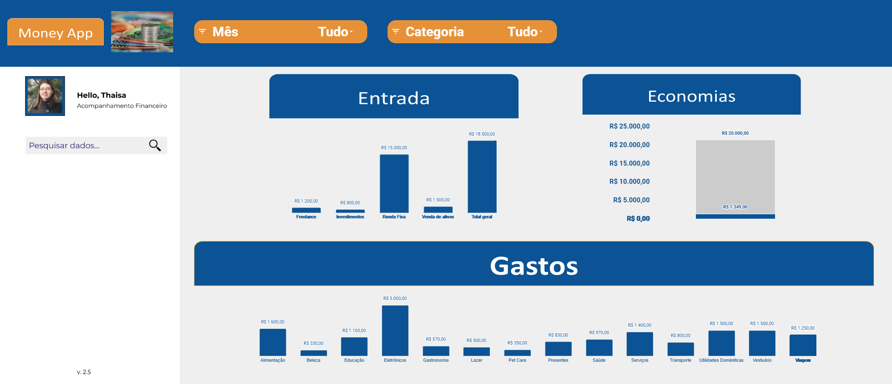

# Projeto IA Generativa
## Planilha Financeira Inteligente"

 > ℹ️ **NOTA**: Este projeto foi criado para o bootcamp DIO "CAIXA - IA Generativa com Microsoft Copilot".

Veja a planilha: 
- [Planilha](https://docs.google.com/spreadsheets/d/1F3ZvlTvGnLzEr86_hA3ctDniyT7-MJCmKlX05UjrYdY/edit?usp=sharing)

  

## 📒 Descrição

Projeto com o objetivo de criar uma planilha de gestão financeira para facilitar análises inteligentes com o uso de IA generativa

## 💻 Tecnologias utilizadas no projeto

- [Google Sheets](https://docs.google.com/spreadsheets)
- [ChatGPT](https://chat.openai.com/) 

## 🧐 Processo de Criação

- ChatGPT: Para realizar análises inteligentes
- Google Sheets: Para criar a base de dados e dashboard

- Aba "Data": Registro de entradas e saídas financeiras.
- Aba "Controller": Criação de Tabelas Dinâmicas para análise de Entradas e Gastos.
- Aba "Caixinha": Criação de Tabela com registros dos depósitos e comparativo com meta de gasto para o gráfico Economias.
- Dashboard interativo: exibe gráficos e tabelas dinâmicas gerados a partir dos dados inseridos, permitindo uma visão clara e detalhada das finanças.
  

## 🚀 Resultados

Veja a planilha: 
- [Planilha](https://docs.google.com/spreadsheets/d/1F3ZvlTvGnLzEr86_hA3ctDniyT7-MJCmKlX05UjrYdY/edit?usp=sharing)

## 👨‍💻 Autoria

    
    
&nbsp&nbsp&nbspThaisa Guio 
    &nbsp&nbsp&nbsp
    <a 
        href="https://github.com/thaisaguio">
        GitHub
    </a>
    &nbsp;|&nbsp;
    <a 
        href="https://www.linkedin.com/thaisa-guio/">
        LinkedIn
    </a>
    &nbsp;|&nbsp;
    <a 
        href="https://www.instagram.com/thaisaguio">
        Instagram
    </a>
    &nbsp;|&nbsp;

  

---

⌨️ com 💜 por [Thaisa Guio](https://github.com/thaisaguio)
